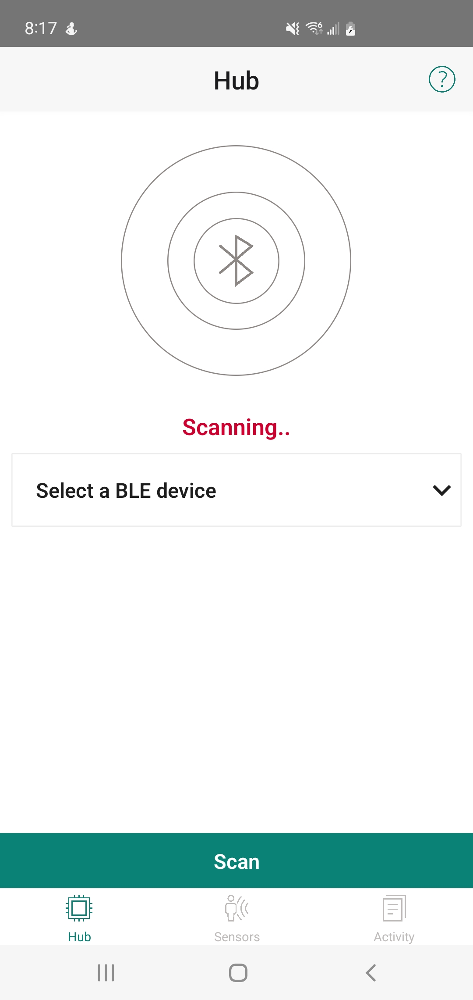

# Bluetooth&reg; LE XENSIV&trade; Sensor Hub sensing service

This code example demonstrates the implementation of a custom Bluetooth&reg; LE sensing profile. It acquires data from the following sensors and transfers them over Bluetooth&reg; as notifications using AIROC&trade; CYW20829 Bluetooth&reg; LE MCU Evaluation Kit (EVK).

- XENSIV&trade; BGT60LTR11AIP radar sensor
- XENSIV&trade; PASCO2 carbon dioxide sensor
- XENSIV&trade; DPS368 barometric pressure sensor
- BMI270 IMU sensor
- BMM350 magnetometer sensor
- SHT35 relative humidity and temperature sensor

Infineon's Sensor Hub Android app can be used to connect to the EVK and display sensor data. 

[View this README on GitHub.](https://github.com/Infineon/mtb-example-btstack-freertos-cyw20829-xensiv-sensorhub)

[Provide feedback on this code example.](https://cypress.co1.qualtrics.com/jfe/form/SV_1NTns53sK2yiljn?Q_EED=eyJVbmlxdWUgRG9jIElkIjoiQ0UyNDA1MDIiLCJTcGVjIE51bWJlciI6IjAwMi00MDUwMiIsIkRvYyBUaXRsZSI6IkJsdWV0b290aCZyZWc7IExFIFhFTlNJViZ0cmFkZTsgU2Vuc29yIEh1YiBzZW5zaW5nIHNlcnZpY2UiLCJyaWQiOiJsbGFuZXNwYXRyaWMiLCJEb2MgdmVyc2lvbiI6IjEuMC4wIiwiRG9jIExhbmd1YWdlIjoiRW5nbGlzaCIsIkRvYyBEaXZpc2lvbiI6Ik1DRCIsIkRvYyBCVSI6IklDVyIsIkRvYyBGYW1pbHkiOiJCVEFCTEUifQ==)


## Requirements

- [ModusToolbox&trade;](https://www.infineon.com/modustoolbox) v3.2 or later (tested with v3.2)
- Programming language: C
- Board support package (BSP) minimum required version for:
   - CYW920829M2EVK-02: v2.0.0
- Associated parts: [AIROC&trade; CYW20829 Bluetooth&reg; LE SoC](https://www.infineon.com/cms/en/product/promopages/airoc20829)


## Supported toolchains (make variable 'TOOLCHAIN')

- GNU Arm&reg; Embedded Compiler v11.3.1 (`GCC_ARM`) – Default value of `TOOLCHAIN`
- Arm&reg; Compiler v6.16 (`ARM`)
- IAR C/C++ Compiler v9.30.1 (`IAR`)


## Supported kits (make variable 'TARGET')

- [AIROC&trade; CYW20829 Bluetooth&reg; LE Evaluation Kit](https://www.infineon.com/CYW920829M2EVK-02) (`CYW920829M2EVK-02`) – Default value of `TARGET`

## Hardware setup

This example uses the board's default configuration. See the kit user guide to ensure that the board is configured correctly.

**Figure 1. CYW920829M2EVK-02 Evaluation Kit** 
 


> **Note:** The AIROC&trade; CYW20829 Bluetooth&reg; kit (CYW920829M2EVK-02) ships with KitProg3 version 2.21 installed. ModusToolbox&trade; requires KitProg3 with latest version 2.40. Before using this code example, make sure that the board is upgraded to KitProg3. The tool and instructions are available in the [Firmware Loader](https://github.com/Infineon/Firmware-loader) GitHub repository. If you do not upgrade, you will see an error like "unable to find CMSIS-DAP device" or "KitProg firmware is out of date".

Additionally, this code example requires the [XENSIV&trade; Sensor Shield](https://www.infineon.com/cms/en/product/evaluation-boards/shield_xensiv_a/). 

**Figure 2. XENSIV&trade; Sensor Shield**

 


## Software setup

See the [ModusToolbox&trade; tools package installation guide](https://www.infineon.com/ModusToolboxInstallguide) for information about installing and configuring the tools package.

This code example consists of two parts: GAP Peripheral and GAP Central.

- **GAP Peripheral:** CYW920829M2EVK-02 Evaluation Kit.
- **GAP Central:** Infineon Sensor Hub mobile application.

Contact [Infineon support](https://www.infineon.com/cms/en/about-infineon/company/contacts/support/) to download the **Infineon Sensor Hub** mobile application. This app will be available on the Google Play Store later. 

> **Note:** The Infineon Sensor Hub app has only been tested on devices running Android 12 and later. 

Install a terminal emulator if you don't have one. Instructions in this document use [Tera Term](https://teratermproject.github.io/index-en.html).


## Using the code example


### Create the project

The ModusToolbox&trade; tools package provides the Project Creator as both a GUI tool and a command line tool.

<details><summary><b>Use Project Creator GUI</b></summary>

1. Open the Project Creator GUI tool.

   There are several ways to do this, including launching it from the dashboard or from inside the Eclipse IDE. For more details, see the [Project Creator user guide](https://www.infineon.com/ModusToolboxProjectCreator) (locally available at *{ModusToolbox&trade; install directory}/tools_{version}/project-creator/docs/project-creator.pdf*).

2. On the **Choose Board Support Package (BSP)** page, select a kit supported by this code example. See [Supported kits](#supported-kits-make-variable-target).

   > **Note:** To use this code example for a kit not listed here, you may need to update the source files. If the kit does not have the required resources, the application may not work.

3. On the **Select Application** page:

   a. Select the **Applications(s) Root Path** and the **Target IDE**.

   > **Note:** Depending on how you open the Project Creator tool, these fields may be pre-selected for you.

   b. Select this code example from the list by enabling its check box.

   > **Note:** You can narrow the list of displayed examples by typing in the filter box.

   c. (Optional) Change the suggested **New Application Name** and **New BSP Name**.

   d. Click **Create** to complete the application creation process.

</details>


<details><summary><b>Use Project Creator CLI</b></summary>

The 'project-creator-cli' tool can be used to create applications from a CLI terminal or from within batch files or shell scripts. This tool is available in the *{ModusToolbox&trade; install directory}/tools_{version}/project-creator/* directory.

Use a CLI terminal to invoke the 'project-creator-cli' tool. On Windows, use the command-line 'modus-shell' program provided in the ModusToolbox&trade; installation instead of a standard Windows command-line application. This shell provides access to all ModusToolbox&trade; tools. You can access it by typing "modus-shell" in the search box in the Windows menu. In Linux and macOS, you can use any terminal application.

The following example clones the "[Bluetooth&reg; LE XENSIV&trade; Sensor Hub sensing service](mtb-example-btstack-freertos-cyw20829-xensiv-sensorhub)" application with the desired name "cyw20829-xensiv-sensorhub" configured for the CYW920829M2EVK-02 BSP into the specified working directory, *C:/mtb_projects*:

   ```
   project-creator-cli --board-id CYW920829M2EVK-02 --app-id mtb-example-btstack-freertos-cyw20829-xensiv-sensorhub --user-app-name cyw20829-xensiv-sensorhub --target-dir "C:/mtb_projects"
   ```


The 'project-creator-cli' tool has the following arguments:

Argument | Description | Required/optional
---------|-------------|-----------
`--board-id` | Defined in the <id> field of the [BSP](https://github.com/Infineon?q=bsp-manifest&type=&language=&sort=) manifest | Required
`--app-id`   | Defined in the <id> field of the [CE](https://github.com/Infineon?q=ce-manifest&type=&language=&sort=) manifest | Required
`--target-dir`| Specify the directory in which the application is to be created if you prefer not to use the default current working directory | Optional
`--user-app-name`| Specify the name of the application if you prefer to have a name other than the example's default name | Optional

> **Note:** The project-creator-cli tool uses the `git clone` and `make getlibs` commands to fetch the repository and import the required libraries. For details, see the "Project creator tools" section of the [ModusToolbox&trade; tools package user guide](https://www.infineon.com/ModusToolboxUserGuide) (locally available at {ModusToolbox&trade; install directory}/docs_{version}/mtb_user_guide.pdf).

</details>


### Open the project

After the project has been created, you can open it in your preferred development environment.


<details><summary><b>Eclipse IDE</b></summary>

If you opened the Project Creator tool from the included Eclipse IDE, the project will open in Eclipse automatically.

For more details, see the [Eclipse IDE for ModusToolbox&trade; user guide](https://www.infineon.com/MTBEclipseIDEUserGuide) (locally available at *{ModusToolbox&trade; install directory}/docs_{version}/mt_ide_user_guide.pdf*).

</details>


<details><summary><b>Visual Studio (VS) Code</b></summary>

Launch VS Code manually, and then open the generated *{project-name}.code-workspace* file located in the project directory.

For more details, see the [Visual Studio Code for ModusToolbox&trade; user guide](https://www.infineon.com/MTBVSCodeUserGuide) (locally available at *{ModusToolbox&trade; install directory}/docs_{version}/mt_vscode_user_guide.pdf*).

</details>


<details><summary><b>Keil µVision</b></summary>

Double-click the generated *{project-name}.cprj* file to launch the Keil µVision IDE.

For more details, see the [Keil µVision for ModusToolbox&trade; user guide](https://www.infineon.com/MTBuVisionUserGuide) (locally available at *{ModusToolbox&trade; install directory}/docs_{version}/mt_uvision_user_guide.pdf*).

</details>


<details><summary><b>IAR Embedded Workbench</b></summary>

Open IAR Embedded Workbench manually, and create a new project. Then select the generated *{project-name}.ipcf* file located in the project directory.

For more details, see the [IAR Embedded Workbench for ModusToolbox&trade; user guide](https://www.infineon.com/MTBIARUserGuide) (locally available at *{ModusToolbox&trade; install directory}/docs_{version}/mt_iar_user_guide.pdf*).

</details>


<details><summary><b>Command line</b></summary>

If you prefer to use the CLI, open the appropriate terminal, and navigate to the project directory. On Windows, use the command-line 'modus-shell' program; on Linux and macOS, you can use any terminal application. From there, you can run various `make` commands.

For more details, see the [ModusToolbox&trade; tools package user guide](https://www.infineon.com/ModusToolboxUserGuide) (locally available at *{ModusToolbox&trade; install directory}/docs_{version}/mtb_user_guide.pdf*).

</details>


## Operation

### Terminal operation

1. Ensure the XENSIV&trade; Sensor Shield is disconnected from the CYW920829M2EVK-02 before flashing.

2. Connect the board to your PC using the provided USB cable through the KitProg3 USB connector.

3. Program the board using one of the following:

   <details><summary><b>Using Eclipse IDE</b></summary>

      1. Select the application project in the Project Explorer.

      2. In the **Quick Panel**, scroll down, and click **\<Application Name> Program (KitProg3_MiniProg4)**.
   </details>


   <details><summary><b>In other IDEs</b></summary>

   Follow the instructions in your preferred IDE.
   </details>


   <details><summary><b>Using CLI</b></summary>

     From the terminal, execute the `make program` command to build and program the application using the default toolchain to the default target. The default toolchain is specified in the application's Makefile but you can override this value manually:
      ```
      make program TOOLCHAIN=<toolchain>
      ```

      Example:
      ```
      make program TOOLCHAIN=GCC_ARM
      ```
   </details>

   > **Note**: Before building the application, ensure that the *deps* folder contains the BSP file (*TARGET_xxx.lib*) corresponding to the TARGET. Execute the `make getlibs` command to fetch the BSP contents before building the application. 

4. After programming, disconnect the USB cable from your PC to remove power from the board.

5. Connect the XENSIV&trade; Sensor Shield board directly to the CYW920829M2EVK-02 kit. Confirm that orientation is correct and pins are aligned before mounting as to not damage the header pins on the XENSIV&trade; Sensor Shield. See **Figure 3**.

   **Figure 3. CYW920829M2EVK-02 Evaluation Kit with XENSIV&trade; Sensor Shield** 
      
    

6. Reconnect the USB cable to your PC.
   
7. Open a terminal program and select the KitProg3 COM port. Set the serial port parameters to 8N1 and 115200 baud.

8. After programming, the application starts automatically. Confirm that "XENSIV&trade; Sensor Hub Service" is displayed on the UART terminal. If you do not see this on the terminal, you can press the **XRES** button located on SW1 on the CYW920829M2EVK-02 kit to reset the MCU.

   **Figure 4. XRES button**
   
   
    
9. There will be a prompt in the terminal to enter a number to enable a sensor.
  
   **Figure 5. Log messages on KitProg3 COM port**
   
   
   
10. Once a number is selected, that sensor will be enabled and the sensor readings will be displayed on the terminal window.

   
### Infineon Sensor Hub mobile app operation

This section explains Bluetooth&reg; LE connectivity between CYW920829M2EVK-02 kit and Infineon Sensor Hub mobile app. 

1. Ensure that your board is flashed with this firmware. See [Terminal operation](#terminal-operation) section for instructions on flashing.
   
2. After programming, the application starts automatically. Confirm that "XENSIV&trade; Sensor Hub Service" is displayed on the UART terminal. If you do not see this on the terminal, you can press the **XRES** button located on SW1 on the CYW920829M2EVK-02 kit to reset the MCU.
   
3. Open the Infineon Sensor Hub mobile app on your mobile device. You will be routed to the Hub screen. 

   **Figure 6. Hub screen** 
   
   
 
4. Tap **Scan** to start scanning nearby CYW920829M2EVK-02 devices.

   **Figure 7. Hub screen - scanning**

   
 
5. All discovered CYW920829M2EVK-02 devices will be populated in the dropdown. Also, displays a toast notification.
   
   **Figure 8. Hub screen - discovered notification**
      
   
      
6. Select the CYW920829M2EVK-02 device to be connected with from the dropdown and tap **Connect**.
   
   **Figure 9. Hub screen - dropdown list**
      
   
       
7. After successful connection, displays a toast notification and the status text changes to **Connected**.
         
   **Figure 10. Hub screen - connected notification**
   
   
   
8. Navigate to the **Sensors** screen to see the list of available sensors populated in the dropdown. 
   
   **Figure 11. Sensors screen - dropdown list**
      
   

9. Select a sensor for data acquisition and it displays a toast notification to confirm sensor selection in CYW920829M2EVK-02 firmware.  
   
   **Figure 12. Sensors screen - SHT35 set**
   
   
  
10. Tap **Read** to start data acquisition from a selected sensor. It displays the data and a toast notification. 
    
    See **Table 1** for more details on how data acquisition is illustrated.   
    
    **Figure 13. Sensors screen - SHT35 data acquisition started**
    
    
  
11. Tap **Stop** to stop data acquisition. Clears the data on the screen and displays a toast notification.
    
    **Figure 14. Sensors screen - SHT35 data acquisition stopped**
    
    
       
12. Once done, go back to the Hub screen and tap **Disconnect**. The connection with the CYW920829M2EVK-02 firmware terminates, displays a toast notification and status text changes to **Not connected**.
    
    **Figure 15. Hub screen - disconnected notification**
    
    

13. All activities are logged in the **Activity** screen. Tap **Clear all** to empty logs.
    
    **Figure 16. Activity screen - logs**

    
  
     
   **Table 1. Sensors**
   
   **Dropdown list** | **Type of data** | **Data illustration**
   ----------------- | ---------------- | ---------------------
   *Radar XENSIV&trade; BGT60LTR11AIP* | Motion, direction of motion (target approaching/departing) | Virtual LED, Red indicates Presence, Green indicates Absence
   *Temperature Humidity Sensor SHT35* | Relative humidity (%) and temperature (°C)| Graph plots
   *IMU Sensor BMI270* | Board orientation | Text only
   *Magnetometer BMM350* | X, Y, Z, and temperature (°C) | Graph plots
   *Pressure Sensor XENSIV&trade; DPS368* | Pressure (hPa) and temperature (°C) | Graph plots
   *CO2 Sensor XENSIV&trade; PASCO2* | CO2 parts per million (ppm) | Graph plots

## Debugging

You can debug the example to step through the code.


<details><summary><b>In Eclipse IDE</b></summary>

Use the **\<Application Name> Debug (KitProg3_MiniProg4)** configuration in the **Quick Panel**. For details, see the "Program and debug" section in the [Eclipse IDE for ModusToolbox&trade; user guide](https://www.infineon.com/MTBEclipseIDEUserGuide).


</details>


<details><summary><b>In other IDEs</b></summary>

Follow the instructions in your preferred IDE.

</details>


## Design and implementation


### Resources and settings

This section explains the ModusToolbox&trade; software resources and their configurations used in this code example. Note that all the configuration explained in this section has already been done in the code example. ModusToolbox&trade; software stores the device configuration settings of the application in the *design.modus* file and Bluetooth&reg; configuration settings of the application in the *design.cybt* file. This file uses the graphical configurators, which generate the configuration firmware. This firmware is stored in the application’s *GeneratedSource* folder.

- **Device Configurator:** Used to enable/configure the peripherals and the pins used in the application. For detailed information on how to use it, see the [Device Configurator guide](https://www.infineon.com/ModusToolboxDeviceConfig).

- **Bluetooth&reg; Configurator:** Used for generating/modifying the Bluetooth&reg; LE GATT database. For detailed information on how to use it, see the [Bluetooth&reg; Configurator guide](https://www.infineon.com/ModusToolboxBLEConfig).

This application demonstrates the Bluetooth&reg; LE peripheral capability of the supported kit. The XENSIV&trade; Sensor Shield sensor values are sent over Bluetooth&reg; LE to a Central device (Infineon Sensor Hub mobile app), and to the UART as debug trace messages. This project demonstrates the following features:

- Bluetooth&reg; LE XENSIV&trade; Sensor Hub service – GATT Read and Notify functionality
- Debug trace messages
- Enabling of sensors through the terminal window via text input. 
- Connection with one Central device
- Connection status indication through LED

The project consists of the following files:

**Table 2. User-application-related source files**

**File name**|**Description**
-----------------------------------|-------------------------------------------------------
*main.c* | Contains the `main()` function, which is the entry point for execution of the user application code after device startup.
*cycfg_bt_settings.c, cycfg_bt_settings.h* | Contains the runtime Bluetooth&reg; stack configuration parameters such as device name and advertisement/connection settings. Note that the name that the device uses for advertising (“sensorhub”) is defined in the *app_bt_cfg.c* file.
*app_bt_gatt_handler.c, app_bt_gatt_handler.h*| Contains the code for the Bluetooth&reg; stack GATT event handler functions.
*cycfg_gatt_db.c, cycfg_gatt_db.h*| Contains the GATT database information generated using the Bluetooth&reg; configurator tool. These files reside in the *GeneratedSource* folder under the application folder.
*uart.c, uart.h*| Contains code for initializing the UART peripheral configured using the Device Configurator tool.
*i2c.c, i2c.h*| Contains code for initializing the I2C peripheral using the HAL.
*bgt60ltr11_task.c, bgt60ltr11_task.h*| Contains code for initializing the XENSIV&trade; BGT60LTR11AIP sensor, and reading the `Target Detect` and `Phase Detect` pins to determine the presence of a target, and the direction of the target if they are approaching toward or departing from the radar.
*bmi270_task.c, bmi270_task.h*| Contains code for initializing the BMI270 sensor and reading the values to estimate the orientation of the board.
*bmm350_task.c, bmm350_task.h*| Contains code for initializing the BMM350 sensor and reading the x, y, z, and temperature values from the sensor.
*dps368_task.c, dps368_task.h*| Contains code for initializing the XENSIV&trade; DPS368 sensor and reading the pressure and temperature values of the sensor.
*pasco2_task.c, pasco2_task.h*| Contains code for initializing the XENSIV&trade; PASCO2 sensor and reading the CO2 values of the sensor.
*sht35_task.c, sht35_task.h*| Contains code for initializing the SHT35 sensor and reading the relative humidity, and temperature values of the sensor.
*console_task.c, console_task.h*| Contains code for printing the console menu and receiving text input to enable each sensor. This task alerts `sensors_task` once a sensor to be selected to be enabled either from the console input or from the Infineon Sensor Hub mobile app.
*sensors_task.c, sensors_task.h*| Contains code for initializing all sensors, then awaiting the `console_task` for a notification to enable a sensor.


#### Flowchart

**Figure 17. Bluetooth&reg; LE XENSIV&trade; Sensor Hub service application**


This flowchart provides an overview of the XENSIV&trade; Sensor Hub application. The XENSIV&trade; Sensor Hub sensing profile in this application consists of one of the Bluetooth&reg; SIG-defined services, namely the "XENSIV&trade; Sensor Shield" (XSS). This project implements custom characteristics for each sensor. These characteristics support notification and read operations, which allow the GATT Server to send data to the connected GATT Client device whenever new data is available, and a read to be performed from the GATT Client device, namely the Infineon Sensor Hub mobile app.

The Bluetooth&reg; Configurator provided by ModusToolbox&trade; makes it easier to design and implement the GATT DB. The Bluetooth&reg; Configurator generates the *cycfg_gatt_db.c* and *cycfg_gatt_db.h* files. All Custom Sensing profile-related variables and functions are contained in these files. When the GATT DB is initialized after Bluetooth&reg; stack initialization, all profile-related values will be ready to be advertised to the Central device. See the [ModusToolbox&trade; Bluetooth&reg; Configurator user guide](https://www.infineon.com/ModusToolboxBLEConfig) for details.

The code example reads data from each sensor and prints these values to the terminal. If a Bluetooth&reg; connection is established with a GATT Client device and notifications are enabled, these sensors values are sent to the device.

When the Peripheral device is connected, the `USER LED2` will be ON; when it is disconnected but still advertising, the `USER LED2` will toggle; when it is disconnected and no longer advertising, the `USER LED2` will be OFF. To turn the LED ON and OFF, generic GPIO functions are used to drive the output pin HIGH or LOW. The LEDs present in the supported kits are active LOW LEDs, which means that the LED turns ON when the GPIO is driven LOW.

The *app_bt_gatt_handler.c* and *app_bt_gatt_handler.h* files handle the functionality of GATT callbacks from the Central device. On receiving a connection request, the Bluetooth&reg; stack gives a GATT event to the application of the `wiced_bt_gatt_evt_t` type.

In *cycfg_bt_settings.c,* all the runtime Bluetooth&reg; stack configuration parameters are defined; these will be initialized during Bluetooth&reg; stack initialization. Some of the configurations include the device name, connection interval, advertisement interval, advertisement channels to use, number of client connections, and maximum transmission unit (MTU). You also have the flexibility to configure the buffer pool size, which helps in optimizing the memory and transmission rate depending on the application use case.

The project also contains *app_bt_utils.c* and *app_bt_utils.h*, which provide APIs to see meaningful messages in debug logs in the debug UART. Most of the status messages in Bluetooth&reg; stack are represented in enumerated values. These functions allow you to view the respective strings instead of the enumerated values.

This application uses a modified *FreeRTOSConfig.h* file to work. Here, the `configTIMER_TASK_PRIORITY` is changed to *6* for the timer task and `configTIMER_TASK_STACK_DEPTH` is changed to *256*. In addition, two other minor modifications are made to the default *FreeRTOSConfig.h* file.


## Related resources

Resources  | Links
-----------|----------------------------------
Application notes  | [AN228571](https://www.infineon.com/AN228571) – Getting started with PSOC&trade; 6 MCU on ModusToolbox&trade; <br> [AN215656](https://www.infineon.com/AN215656) – PSOC&trade; 6 MCU: Dual-CPU system design
Code examples  | [Using ModusToolbox&trade;](https://github.com/Infineon/Code-Examples-for-ModusToolbox-Software) on GitHub
Device documentation | [PSOC&trade; 6 MCU datasheets](https://documentation.infineon.com/html/psoc6/bnm1651211483724.html) <br> [PSOC&trade; 6 technical reference manuals](https://documentation.infineon.com/html/psoc6/zrs1651212645947.html)<br>[AIROC&trade; CYW20829 Bluetooth&reg; LE SoC](https://www.infineon.com/cms/en/product/promopages/airoc20829)
Development kits | Select your kits from the [Evaluation board finder](https://www.infineon.com/cms/en/design-support/finder-selection-tools/product-finder/evaluation-board).
Libraries on GitHub  | [mtb-pdl-cat1](https://github.com/Infineon/mtb-pdl-cat1) – Peripheral Driver Library (PDL)  <br> [mtb-hal-cat1](https://github.com/Infineon/mtb-hal-cat1) – Hardware Abstraction Layer (HAL) library <br> [retarget-io](https://github.com/Infineon/retarget-io) – Utility library to retarget STDIO messages to a UART port
Middleware on GitHub  | [capsense](https://github.com/Infineon/capsense) – CAPSENSE&trade; library and documents <br> [psoc6-middleware](https://github.com/Infineon/modustoolbox-software#psoc-6-middleware-libraries) – Links to all PSOC&trade; 6 MCU middleware
Tools  | [ModusToolbox&trade;](https://www.infineon.com/modustoolbox) – ModusToolbox&trade; software is a collection of easy-to-use libraries and tools enabling rapid development with Infineon MCUs for applications ranging from wireless and cloud-connected systems, edge AI/ML, embedded sense and control, to wired USB connectivity using PSOC&trade; Industrial/IoT MCUs, AIROC&trade; Wi-Fi and Bluetooth&reg; connectivity devices, XMC&trade; Industrial MCUs, and EZ-USB&trade;/EZ-PD&trade; wired connectivity controllers. ModusToolbox&trade; incorporates a comprehensive set of BSPs, HAL, libraries, configuration tools, and provides support for industry-standard IDEs to fast-track your embedded application development.

<br>


## Other resources

Infineon provides a wealth of data at [www.infineon.com](https://www.infineon.com) to help you select the right device, and quickly and effectively integrate it into your design.


## Document history

Document title: *CE240502* – *Bluetooth&reg; LE XENSIV&trade; Sensor Hub sensing service*

 Version | Description of change
 ------- | ---------------------
 1.0.0   | New code example
<br>


All referenced product or service names and trademarks are the property of their respective owners.

The Bluetooth&reg; word mark and logos are registered trademarks owned by Bluetooth SIG, Inc., and any use of such marks by Infineon is under license.


---------------------------------------------------------

© Cypress Semiconductor Corporation, 2024. This document is the property of Cypress Semiconductor Corporation, an Infineon Technologies company, and its affiliates ("Cypress").  This document, including any software or firmware included or referenced in this document ("Software"), is owned by Cypress under the intellectual property laws and treaties of the United States and other countries worldwide.  Cypress reserves all rights under such laws and treaties and does not, except as specifically stated in this paragraph, grant any license under its patents, copyrights, trademarks, or other intellectual property rights.  If the Software is not accompanied by a license agreement and you do not otherwise have a written agreement with Cypress governing the use of the Software, then Cypress hereby grants you a personal, non-exclusive, nontransferable license (without the right to sublicense) (1) under its copyright rights in the Software (a) for Software provided in source code form, to modify and reproduce the Software solely for use with Cypress hardware products, only internally within your organization, and (b) to distribute the Software in binary code form externally to end users (either directly or indirectly through resellers and distributors), solely for use on Cypress hardware product units, and (2) under those claims of Cypress's patents that are infringed by the Software (as provided by Cypress, unmodified) to make, use, distribute, and import the Software solely for use with Cypress hardware products.  Any other use, reproduction, modification, translation, or compilation of the Software is prohibited.
<br>
TO THE EXTENT PERMITTED BY APPLICABLE LAW, CYPRESS MAKES NO WARRANTY OF ANY KIND, EXPRESS OR IMPLIED, WITH REGARD TO THIS DOCUMENT OR ANY SOFTWARE OR ACCOMPANYING HARDWARE, INCLUDING, BUT NOT LIMITED TO, THE IMPLIED WARRANTIES OF MERCHANTABILITY AND FITNESS FOR A PARTICULAR PURPOSE.  No computing device can be absolutely secure.  Therefore, despite security measures implemented in Cypress hardware or software products, Cypress shall have no liability arising out of any security breach, such as unauthorized access to or use of a Cypress product. CYPRESS DOES NOT REPRESENT, WARRANT, OR GUARANTEE THAT CYPRESS PRODUCTS, OR SYSTEMS CREATED USING CYPRESS PRODUCTS, WILL BE FREE FROM CORRUPTION, ATTACK, VIRUSES, INTERFERENCE, HACKING, DATA LOSS OR THEFT, OR OTHER SECURITY INTRUSION (collectively, "Security Breach").  Cypress disclaims any liability relating to any Security Breach, and you shall and hereby do release Cypress from any claim, damage, or other liability arising from any Security Breach.  In addition, the products described in these materials may contain design defects or errors known as errata which may cause the product to deviate from published specifications. To the extent permitted by applicable law, Cypress reserves the right to make changes to this document without further notice. Cypress does not assume any liability arising out of the application or use of any product or circuit described in this document. Any information provided in this document, including any sample design information or programming code, is provided only for reference purposes.  It is the responsibility of the user of this document to properly design, program, and test the functionality and safety of any application made of this information and any resulting product.  "High-Risk Device" means any device or system whose failure could cause personal injury, death, or property damage.  Examples of High-Risk Devices are weapons, nuclear installations, surgical implants, and other medical devices.  "Critical Component" means any component of a High-Risk Device whose failure to perform can be reasonably expected to cause, directly or indirectly, the failure of the High-Risk Device, or to affect its safety or effectiveness.  Cypress is not liable, in whole or in part, and you shall and hereby do release Cypress from any claim, damage, or other liability arising from any use of a Cypress product as a Critical Component in a High-Risk Device. You shall indemnify and hold Cypress, including its affiliates, and its directors, officers, employees, agents, distributors, and assigns harmless from and against all claims, costs, damages, and expenses, arising out of any claim, including claims for product liability, personal injury or death, or property damage arising from any use of a Cypress product as a Critical Component in a High-Risk Device. Cypress products are not intended or authorized for use as a Critical Component in any High-Risk Device except to the limited extent that (i) Cypress's published data sheet for the product explicitly states Cypress has qualified the product for use in a specific High-Risk Device, or (ii) Cypress has given you advance written authorization to use the product as a Critical Component in the specific High-Risk Device and you have signed a separate indemnification agreement.
<br>
Cypress, the Cypress logo, and combinations thereof, ModusToolbox, PSoC, CAPSENSE, EZ-USB, F-RAM, and TRAVEO are trademarks or registered trademarks of Cypress or a subsidiary of Cypress in the United States or in other countries. For a more complete list of Cypress trademarks, visit www.infineon.com. Other names and brands may be claimed as property of their respective owners.
